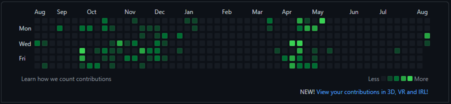
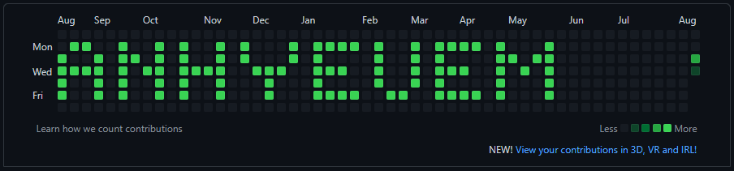

# Github Pixels

## What is Github Pixels?

Github Pixels is an google chrome extension for drawing and creating pixel words to [github contributions calendar](https://docs.github.com/en/account-and-profile/setting-up-and-managing-your-github-profile/managing-contribution-settings-on-your-profile/viewing-contributions-on-your-profile#contributions-calendar)

A fun extension that make your contributions calendar more interesting, less boring (like me 😂)

- Before:

  

- After:

  

---

## How to install extension

- On top of this repo, click on `Code` → `Download ZIP`
- On your computer, unzip the file you have downloaded
- Go to Google chrome, click on `Manage extension` and turn on `Developer mode`
- Click on `Load unpackage` → Choose the unzip file → `OK`

Now you can give it a try 😋

---

_Notice_: This is still in beta, you can only using alphabet character (a-z and A-Z, no space). If you found a bugs, please open an issue
